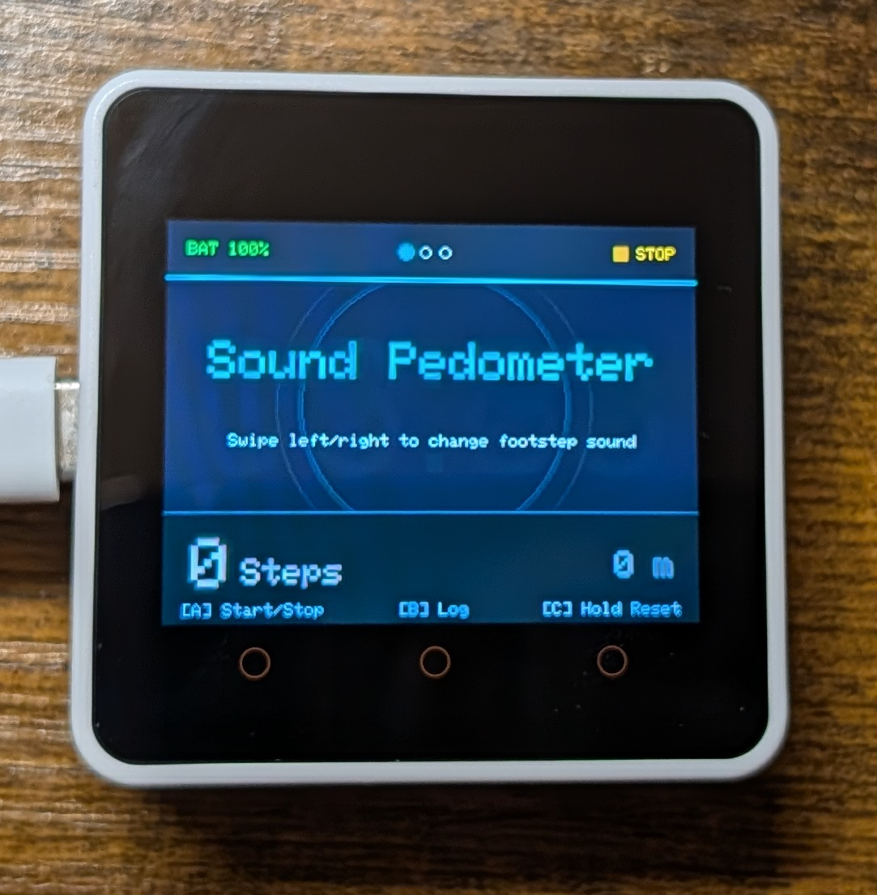
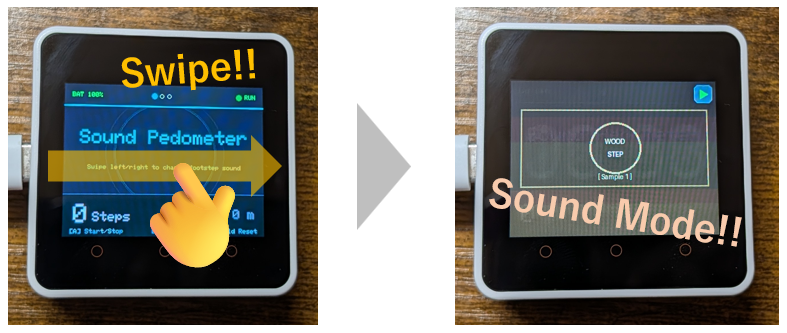
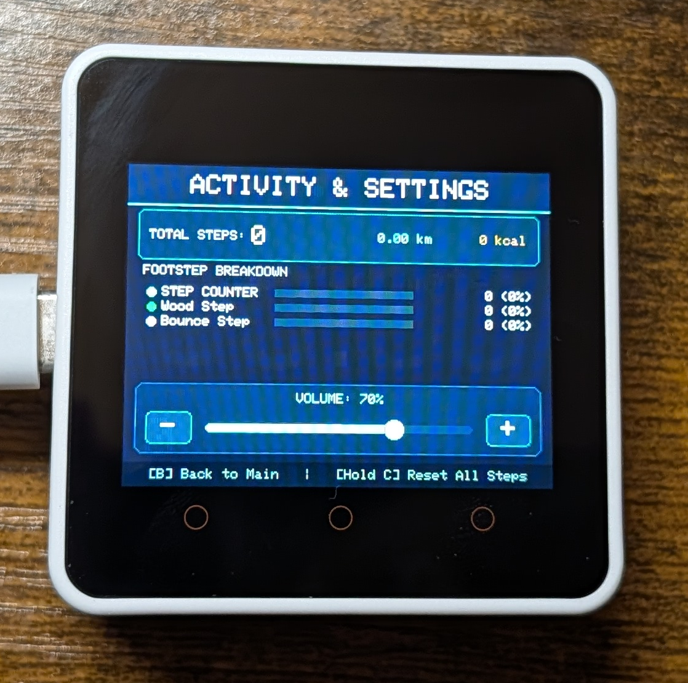

# m5-step-sound-counter

M5Stack Core2 を使った万歩計（Pedometer）システムです。
歩くたびに設定した効果音や足音がゼロ遅延で鳴ります。
人間の腰あたりに装着して使用することを想定しています。

---

## 主な機能・特徴

1. **ゼロ遅延の足音再生**:
   - 音声ファイルは起動時にPSRAM/内部RAMへ事前キャッシュされるため、歩行検出の瞬間に遅延なく発音します。
2. **左右スワイプでのテーマ（足音・キャラクター画像）切り替え**:
   - 画面を左右にスワイプするだけで、瞬時にテーマを切り替え可能（カウント動作中も切り替え可能）。
3. **視認性と操作性に優れたUI**:
   - **トップ画面（タイトル画面）**:
     - 左上にバッテリー残量（`BAT %`）、中央にテーマインジケータードット、右上に動作ステータス（`● RUN` / `■ STOP`）。
     - 下部バーに総歩数と推定移動距離を表示。
   - **キャラクター画像画面**:
     - キャラクター画像が全面に大きく表示され、右上には邪魔にならないコンパクトなステータスバッジ（`▶` 緑 / `■` オレンジ）を配置。
4. **NVSデータ永続化**:
   - 歩数、選択中のテーマ、音量設定は電源を切っても保持されます。
5. **詳細なログ＆設定画面**:
   - ボタンBでログ画面を表示。総歩数、移動距離、推定消費カロリー、テーマ別の歩数内訳バーグラフ、音量調整スライダーを備えています。

---

## 画面操作・ボタン操作

### ボタン操作（Core2 下部タッチボタン）
- **[A] ボタン**: カウント開始／停止（RUN / STOP）
- **[B] ボタン**: ログ＆設定画面の表示 ／ メイン画面へ戻る
- **[C] ボタン（長押し 約1.5秒）**: 歩数カウントおよび保存データのリセット（確認音とともにリセット）



### 画面タッチ操作
- **メイン画面**: 画面上を左右にスワイプしてテーマ（足音・画像）を切り替え

- **ログ＆設定画面**:
  - `[-]` / `[+]` ボタンのタップ、またはスライダートラックのドラッグでスピーカー音量（0%〜100%）を調整可能


---

## ディレクトリ構成 (`data/`)

画像や音声、テーマ定義はすべて `data/` ディレクトリで管理されており、SPIFFSファイルシステム経由でM5Stack Core2に書き込まれます。

```
data/
  ├── themes.json          # テーマ定義設定ファイル
  ├── image/               # 画面表示用画像 (PNG形式, 320x240推奨)
  │     ├── Sample_Wood.png
  │     └── Sample_Bounce.png
  └── wav/                 # 足音・効果音 (WAV形式, 16-bit PCM, 22.05kHzモノラル推奨)
        ├── Sample_Wood.wav
        └── Step_Bounce.wav
```

---

## テーマ・足音・画像のカスタマイズ (`data/themes.json`)

`data/themes.json` を編集することで、プログラムの再コンパイルを行うことなくテーマの追加・変更・並び替えが可能です。

```json
[
  {
    "id": "Default",
    "name": "STEP COUNTER",
    "image": "",
    "wav": "",
    "color": "0x07FF"
  },
  {
    "id": "Wood",
    "name": "Wood Step",
    "image": "/image/Sample_Wood.png",
    "wav": "/wav/Sample_Wood.wav",
    "color": "0x34E1"
  },
  {
    "id": "Bounce",
    "name": "Bounce Step",
    "image": "/image/Sample_Bounce.png",
    "wav": "/wav/Step_Bounce.wav",
    "color": "0x00E5FF"
  }
]
```

- **`id`**: テーマの一意識別子
- **`name`**: テーマの表示名称
- **`image`**: 表示するPNG画像のSPIFFSパス（空文字 `""` の場合はスタイリッシュな幾何学タイトル画面）
- **`wav`**: 再生するWAV音声のSPIFFSパス（空文字 `""` の場合は無音モード）
- **`color`**: テーマカラー（`"0x07FF"` や `"#00E5FF"` 形式）

---

## ビルドと書き込み方法

### 必要な環境
- [PlatformIO](https://platformio.org/) (VSCode 拡張機能または CLI)

### ファームウェアの書き込み
```bash
# ファームウェアのビルド＆書き込み
pio run -t upload
```

### アセット（画像・音声・設定）の書き込み
`data/` フォルダ内のファイルをM5Stack Core2のSPIFFSに転送します：
```bash
pio run -t uploadfs
```

---

## 音声ファイルの最適化 (`convert_audio.py`)

小型スピーカーでの再生に最適な音質・音圧にするための変換スクリプトを用意しています。
`data/wav/` 内の音声を自動でノーマライズします：

```bash
python convert_audio.py
```
